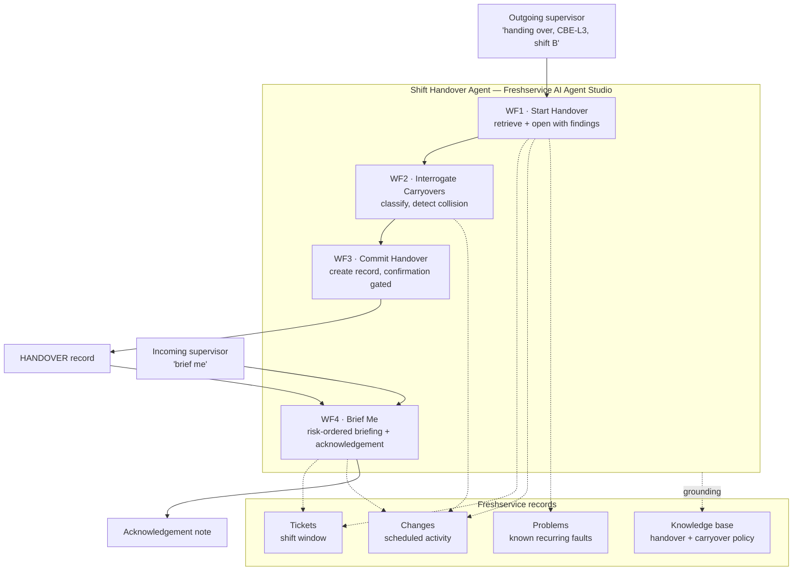

# Shift Handover Intelligence

**An AI agent that interrogates the outgoing shift instead of transcribing it.**

Built on Freshservice AI Agent Studio for The Great Agent Hackathon (TGPF 2026), Track 1 — Customer & Employee Experience.

---

## The problem

Startup, shutdown and changeover periods account for **less than 5% of operational staff time but 40% of plant incidents**. In the process industry, *"every second incident or accident is related to communication errors that occurred during shift handovers."*

This is not theoretical. It is the documented contributory factor in the worst industrial disasters on record:

| Incident | Finding |
|---|---|
| **Piper Alpha** (1988, 167 dead) | The Cullen inquiry found that a removed pressure safety valve and the blind flange fitted in its place **were never communicated between shifts**. No written handover procedure existed; what got recorded was left to individual operator discretion. |
| **Texas City Refinery** (2005) | Investigators described a **"total failure of shift handover management"** — no procedures in use, lead operator absent, logbooks missing required detail. |
| **Buncefield** | No effective handover arrangements. Supervisors were **confused about which tank was being filled**. |

**80% of facilities still run unstructured logbooks.** Three shifts a day, 365 days a year, is **1,095 handovers per line per year** — almost all of them verbal or free-text, at the exact moment the plant is statistically most dangerous.

## The insight

Every product in this space treats handover as a **documentation** problem and ships a better logbook. That is the wrong diagnosis.

Handover is a **selective attention** problem. The outgoing supervisor writes down what is salient *to them* — and by definition cannot know what will turn out to matter to the person arriving. A free-text logbook makes this worse, not better, because it is infinitely permissive. It will happily accept *"quiet shift, nothing to report"* from someone who left a safety valve removed.

An agent inverts the relationship. Because it can see the shift's actual record — every ticket raised, every change scheduled for the incoming shift, every problem still open — **it can interrogate the outgoing supervisor rather than transcribe them.**

> *"You logged two stoppages on CBE-L3 this shift, both fault 4021. Same root cause or separate events? I'm asking because Shift C has a tooling changeover on that line at 02:00, and a changeover power-cycles the interlock chain."*

No logbook can ask that question. That single behaviour is the entire product.

## What the agent actually does

It finds the thing nobody is looking for: a **collision**.

A collision is an unresolved carryover sharing a line with scheduled activity in the incoming window. Neither supervisor has any reason to spot it — the outgoing one is thinking about what happened, the incoming one about what is planned. **Nobody is thinking about the overlap.**

In the demo scenario:

```
16:20  CBE-L3 stops.  Fault 4021, gate interlock.  12 min lost.
19:45  CBE-L3 stops.  Fault 4021 again.  Different operator, logged separately.  18 min lost.
20:10  Maintenance opens the gate housing to inspect switch S2-B.  Shift ends.  JOB STILL OPEN.
02:00  Scheduled: CBE-L3 tooling changeover — which power-cycles the interlock chain.
```

Three records, three different people, three different systems of record. The agent is the only participant that sees all three at once.

---

## Architecture



### Why one agent and not several

Track 1 names *multi-agent orchestration*. Agent Studio has **no agent-to-agent handoff** — the Agent handoff node transfers to human agents only.

That constraint turns out to match the evidence. Production surveys of multi-agent systems report that free-form patterns fail hard: dynamic handoff produces infinite A→B→C→A loops and compounding context loss, and multi-agent debate produces *"sycophancy cascading"* where agents reinforce each other into confidently-wrong answers. **Orchestrator-worker survives because delegation is constrained.**

So this is orchestrator-worker: one agent, four bounded workflows with disjoint intent triggers, routed by the LLM. Two distinct roles — a **Capture** agent with an extraction agenda (WF1–WF3) and a **Briefing** agent with a synthesis agenda (WF4) — implemented as workflows rather than as separate agents passing context between them. That is a deliberate design decision, not a workaround.

### Why the platform's hardest constraint doesn't bite

Agent Studio agents are **reactive only** — they cannot be triggered by system events. For most agent ideas that is a wound you engineer around.

Shift handover is naturally two-sided and **both sides are human-initiated.** The outgoing supervisor starts a handover because their shift is ending. The incoming supervisor asks for a briefing because theirs is beginning. The platform's hardest limitation is simply not a limitation for this problem.

### The safety-grade detail

**Closed-loop acknowledgement.** The handover is not complete until the incoming supervisor explicitly acknowledges every Category 1 and Category 2 item. This directly answers the failure mode the HSE research names — *the flawed assumption that all staff share common understanding.*

Piper Alpha's handover was "complete" in the sense that one shift ended and another began. Nobody ever confirmed receipt of the one fact that mattered.

### Carryover risk model

| Category | Meaning | Acknowledgement required |
|---|---|---|
| **1** | Maintenance in progress across the boundary | **Yes** |
| **2** | Recurring or unresolved fault | **Yes** |
| **3** | Scheduled activity in the incoming window | No |
| **4** | Informational — consumables, calibration, housekeeping | No |

Where a Category 1 or 2 item shares a line with a Category 3 item, that is a **collision** and is escalated.

---

## Repository layout

```
.
├── README.md                       this file
├── setup_env.sh                    dedicated conda env + Jupyter kernel
├── docs/
│   ├── 01-agent-config.md          copy-paste build sheet for Agent Studio, documented as built
│   └── 02-ai-actions-app.md        how the Stage 2 AI Actions app works, in detail
├── seed/
│   ├── purge_freshservice.py       clears prior demo data, dry-run by default
│   └── seed_shift_handover.py      builds the Kestrel Components corpus
└── ai-actions-app/                 the Stage 2 FDK app (62 tests, 98.63% coverage)
```

Submission materials — the written Devpost copy, the video shot list, and the platform research that informed the design — live **outside this repository**, in `Freshworks_Hackathon_SUBMISSION/`. Nothing in this repo is needed to read them, and nothing in them is needed to run the agent.

## Getting started

### 1. Environment

This project runs in a dedicated, isolated conda environment. Nothing else lives in it — FDK 10.x requires Node 24.x, and sharing an environment with a project pinned to Node 22 is how you end up debugging a packaging failure that is really a version mismatch.

```bash
bash setup_env.sh          # creates conda env `freshworks`, registers the Jupyter kernel
conda activate freshworks
```

| | |
|---|---|
| Environment | `freshworks` |
| Python | 3.12 — the seed scripts use the **standard library only**, nothing to pip install |
| Node | 24.x, from conda-forge, required by FDK 10.x |
| Jupyter kernel | `Freshworks Hackathon (freshworks)` |

### 2. Seed the instance

```bash
export FRESHSERVICE_DOMAIN=your-domain.freshservice.com
export FRESHSERVICE_API_KEY=...          # Profile settings → Show API Key

cd seed
python3 purge_freshservice.py            # dry run
python3 purge_freshservice.py --confirm
python3 seed_shift_handover.py --dry-run
python3 seed_shift_handover.py
```

Then follow `docs/01-agent-config.md` to build the agent. Every field is copy-paste ready.

### 3. Stage 2 app

```bash
cd ai-actions-app
npm install && npm test                  # 62 tests, 98.63% statement coverage
fdk validate && fdk pack
```

## Tech stack

| Layer | Technology |
|---|---|
| Agent | Freshservice **AI Agent Studio** (Freddy AI) — 4 workflows, 5 node types |
| Records | Freshservice tickets, changes, problems, solutions |
| Integration | Custom API actions over the Freshservice REST API v2 |
| Stage 2 | Freshworks **FDK 10.x** AI Actions app, Node 24, platform v3.0 |
| Testing | vitest with v8 coverage, thresholds matched to the `fdk pack` gate |
| Demo data | Python 3, idempotent seeder with dry-run |

## Constraints this was designed against

Verified against a live Freshservice instance, not assumed:

- Agents are **reactive only** — no system-event triggers
- **No agent-to-agent handoff** — the handoff node targets humans
- **Six node types**: Collect info, API Action, Execute Function, Condition paths, Custom response, Agent handoff
- 14 pre-built **Functions** cover arithmetic, date comparison and string ops — but there is **no iteration and no grouping** over a collection
- **500-character limit** on each Custom response instruction
- **2,500 characters** total instruction budget
- CMDB, assets, products, applications and projects are **plan-gated** on the target instance and unreachable
- AI Actions apps publish as **Custom apps only** — no public Marketplace listing
- The API action **payload editor validates JSON on every property insert** — inserting a variable into incomplete JSON collapses the body to `{}`
- The first-party *Freshservice for AI Agents* app requires an API key typed into an install form; a custom `POST` action with a hidden `Authorization` header reaches the same endpoints

## Sources

- [Why poor shift handover can lead to serious incidents](https://www.ehstoday.com/safety/article/21920292/why-poor-shift-handover-can-lead-to-serious-oil-gas-incidents) — the 40% figure, Piper Alpha / Texas City / Buncefield findings, 80% unstructured logbooks
- [Unplanned downtime cost, 2026](https://www.info2soft.com/blogs/unplanned-downtime-cost-2026-updated.html) — $1.4T Fortune Global 500, cause breakdown
- [Multi-agent orchestration patterns for production](https://beam.ai/agentic-insights/multi-agent-orchestration-patterns-production) — why constrained delegation survives
- [AI Actions — Freshworks App SDK v3.0](https://developers.freshworks.com/docs/app-sdk/v3.0/common/serverless-apps/ai-actions/)
