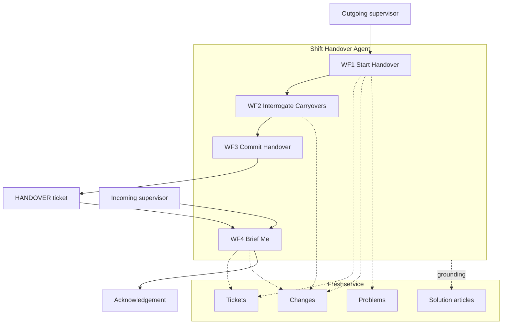

# Shift Handover Intelligence

An AI agent that interrogates the outgoing shift instead of transcribing it.

Built on Freshservice AI Agent Studio for The Great Agent Hackathon, TGPF 2026, Track 1.

Demo: https://youtu.be/rbx7h7k8etI

---

## The problem

Shift change takes up less than 5% of operational staff time and accounts for **40% of plant incidents**. In the process industry, roughly every second incident traces back to a communication failure at handover.

Three of the worst industrial inquiries on record say the same thing.

| Incident | Finding |
|---|---|
| **Piper Alpha**, 1988, 167 dead | The Cullen inquiry found that a removed pressure safety valve and the blind flange fitted in its place were never communicated between shifts. No written handover procedure existed. What got recorded was left to each operator's discretion. |
| **Texas City Refinery**, 2005 | Investigators described a total failure of shift handover management: no procedure in use, the lead operator absent, logbooks missing required detail. |
| **Buncefield** | No effective handover arrangements. Supervisors were confused about which tank was being filled. |

80% of facilities still run unstructured logbooks. Three shifts a day, 365 days a year, works out at 1,095 handovers per line per year, almost all of them verbal or free text, at the moment the plant is statistically most dangerous.

## Why forty years of software hasn't fixed it

Every product in this space treats handover as a documentation problem and ships a better logbook: structured fields, mandatory sections, mobile capture, e-signatures. None of it works, because handover is a problem of selective attention rather than of record keeping.

The outgoing supervisor writes down what is salient to them, and can't know what will turn out to matter to the person arriving. A free text logbook makes that worse rather than better, because it's infinitely permissive. It will accept "quiet shift, nothing to report" from someone who left a safety valve out.

You can't fix selective attention by improving the form. You fix it by putting something in the room that has already read the record and isn't relying on recall.

An agent inverts the relationship. Because it can see the shift's actual record, every ticket raised, every change scheduled for the incoming window, every problem still open, it can interrogate the outgoing supervisor rather than transcribe them.

> "You logged two stoppages on CBE-L3 this shift, both fault 4021. Same root cause or separate events? I'm asking because Shift C has a tooling changeover on that line at 02:00, and a changeover power-cycles the interlock chain."

No logbook can ask that question.

## What it finds

A **collision**: an unresolved carryover sharing a line or a circuit with scheduled activity in the incoming window.

Neither supervisor has any reason to spot one. The outgoing supervisor is thinking about what happened, the incoming one about what is planned, and nobody is thinking about the overlap.

```
16:20  CBE-L3 stops.  Fault 4021, gate interlock.  12 min lost.       Operator A
19:45  CBE-L3 stops.  Fault 4021 again.  18 min lost.                 Operator B, separate ticket
20:10  Maintenance opens the gate housing to inspect switch S2-B.     Maintenance
       Shift ends.  Job still open.
02:00  Scheduled: CBE-L3 tooling changeover.                          Planning
       Cycles control power.  Re-initialises the interlock chain.
```

Three records, three different people, three different systems, each of them individually unremarkable. The agent is the only participant in the handover that sees all three at once.

Verbatim, from the live instance:

> Collision to flag: CBE-L3 has an open Category 1 maintenance job on gate 2 interlock, and a planned tooling changeover on CBE-L3 in Shift C at 02:00 where control power will be cycled and the entire gate interlock chain re-initialised.

## Carryover risk model

Held in the Freshservice knowledge base, so the agent's judgement comes from the plant's own rules rather than from improvisation.

| Category | Meaning | Acknowledgement required |
|---|---|---|
| 1 | Maintenance in progress across the shift boundary | Yes |
| 2 | Recurring or unresolved fault | Yes |
| 3 | Scheduled activity in the incoming window | No |
| 4 | Informational: consumables, calibration, housekeeping | No |

A Category 1 or 2 item sharing a line with a Category 3 item is a collision, and goes to the top of the briefing regardless of anything else.

---

## Architecture



| | Workflow | Role |
|---|---|---|
| WF1 | Start Handover | reads the shift record, opens with what it found, asks the highest-priority question |
| WF2 | Interrogate Carryovers | classifies against policy, detects and explains the collision |
| WF3 | Commit Handover | writes the handover record to Freshservice |
| WF4 | Brief Me | briefing in risk order, asks for acknowledgement |

### One agent, not several

Track 1 names multi-agent orchestration, and the honest answer is that Agent Studio has no agent-to-agent handoff. Its handoff node targets human agents only.

That constraint matches the evidence. Production surveys of multi-agent systems in 2026 report that the free-form patterns fail hard. Dynamic handoff produces infinite loops and compounding context loss. Multi-agent debate produces sycophancy cascading, where agents reinforce one another into confidently wrong answers. Orchestrator-worker survives because delegation stays constrained.

So this is orchestrator-worker: one agent, four workflows with disjoint intent triggers, routed by the model. Two distinct roles, a capture agenda in WF1 to WF3 and a synthesis agenda in WF4, implemented as bounded workflows rather than as separate agents passing context between them.

### Why the platform's hardest constraint doesn't bite

Agent Studio agents are reactive only. They can't be triggered by system events, which for most agent ideas is a wound you engineer around.

Shift handover is naturally two-sided and both sides are human-initiated. The outgoing supervisor starts a handover because their shift is ending. The incoming supervisor asks for a briefing because theirs is beginning. We chose the problem partly for that reason.

### Closed-loop acknowledgement

The handover isn't complete when the shift ends. It's complete when the incoming supervisor has acknowledged every Category 1 and Category 2 item.

Piper Alpha's handover was "complete" in the sense that one shift ended and another began. Nobody ever confirmed receipt.

---

## Repository layout

```
.
├── README.md
├── setup_env.sh                    dedicated conda env and Jupyter kernel
├── docs/
│   ├── 01-agent-config.md          copy-paste build sheet, documented as built
│   └── 02-ai-actions-app.md        how the Stage 2 AI Actions app works
├── seed/
│   ├── purge_freshservice.py       clears prior demo data, dry-run by default
│   └── seed_shift_handover.py      builds the Kestrel Components corpus
└── ai-actions-app/                 Stage 2 FDK app, 62 tests, 98.63% coverage
```

Submission material, the written entry and the video script, lives outside this repository. Nothing here depends on it.

## Getting started

### 1. Environment

FDK 10.x needs Node 24.x, so this project gets its own conda environment. Sharing one with a project pinned to Node 22 is how you end up debugging a packaging failure that is really a version mismatch.

```bash
bash setup_env.sh
conda activate freshworks
```

| | |
|---|---|
| Environment | `freshworks` |
| Python | 3.12. The seed scripts use the standard library only |
| Node | 24.x from conda-forge |
| Jupyter kernel | `Freshworks Hackathon (freshworks)` |

### 2. Seed the instance

```bash
export FRESHSERVICE_DOMAIN=your-domain.freshservice.com
export FRESHSERVICE_API_KEY=...          # Profile settings, Show API Key

cd seed
python3 purge_freshservice.py            # dry run
python3 purge_freshservice.py --confirm
python3 seed_shift_handover.py --dry-run
python3 seed_shift_handover.py
```

This builds Kestrel Components, a fictional tier-1 automotive supplier with lines CBE-L1 to CBE-L3 at Coimbatore and PUN-L1 at Pune, and plants three traps in one Shift B window: two stoppages with the same fault signature logged by different operators, an open maintenance job that crosses the shift boundary, and a changeover scheduled at 02:00 on the same interlock.

The collision between those three is the demo.

### 3. Build the agent

`docs/01-agent-config.md` is a copy-paste build sheet. Every field is given verbatim, with character counts checked against Agent Studio's limits.

### 4. Stage 2 app

```bash
cd ai-actions-app
npm install && npm test                  # 62 tests, 98.63% statement coverage
fdk validate && fdk pack
```

## Tech stack

| Layer | Technology |
|---|---|
| Agent | Freshservice AI Agent Studio (Freddy AI), four workflows across six node types |
| Records | Freshservice tickets, changes, problems, solution articles |
| Integration | Custom API actions over the Freshservice REST API v2 |
| Stage 2 | Freshworks FDK 10.x, Node 24, platform v3.0 |
| Testing | vitest with v8 coverage, thresholds matched to the `fdk pack` gate |
| Demo data | Python 3, idempotent seeder with dry-run and a live capability probe |

## Platform constraints this was designed against

Verified against a live instance rather than assumed.

- Agents are reactive only. No system-event triggers.
- No agent-to-agent handoff. The handoff node targets humans.
- Six node types: Collect info, API Action, Execute Function, Condition paths, Custom response, Agent handoff.
- Fourteen pre-built Functions cover arithmetic, date comparison and string operations. There is no iteration and no grouping over a collection.
- 500 character limit on each Custom response instruction. 2,500 total instruction budget.
- CMDB, assets, products, applications and projects are plan-gated on the target instance and return `403 require_feature`.
- `POST /service_catalog/items` returns `405`. Categories can be created, items cannot.
- Change creation rejects any status that is not the configured stateflow entry state.
- The API action payload editor validates JSON on every variable insert. Inserting a property into incomplete JSON collapses the body to `{}`.
- "Ask for confirmation" on an API action node prevents the action from executing in the support portal. The agent reports success and writes nothing.
- AI Actions apps publish as Custom apps only. No public Marketplace listing.

## Sources

- [Why poor shift handover can lead to serious incidents](https://www.ehstoday.com/safety/article/21920292/why-poor-shift-handover-can-lead-to-serious-oil-gas-incidents), the 40% figure, the Piper Alpha, Texas City and Buncefield findings, and the 80% logbook figure
- [Unplanned downtime cost, 2026](https://www.info2soft.com/blogs/unplanned-downtime-cost-2026-updated.html)
- [Multi-agent orchestration patterns for production](https://beam.ai/agentic-insights/multi-agent-orchestration-patterns-production)
- [AI Actions, Freshworks App SDK v3.0](https://developers.freshworks.com/docs/app-sdk/v3.0/common/serverless-apps/ai-actions/)

---

Built by [Jonathan Jerrick](https://github.com/Jonathan-Jerrick) for TGPF 2026.
